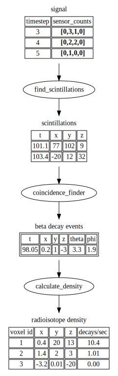
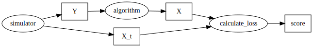
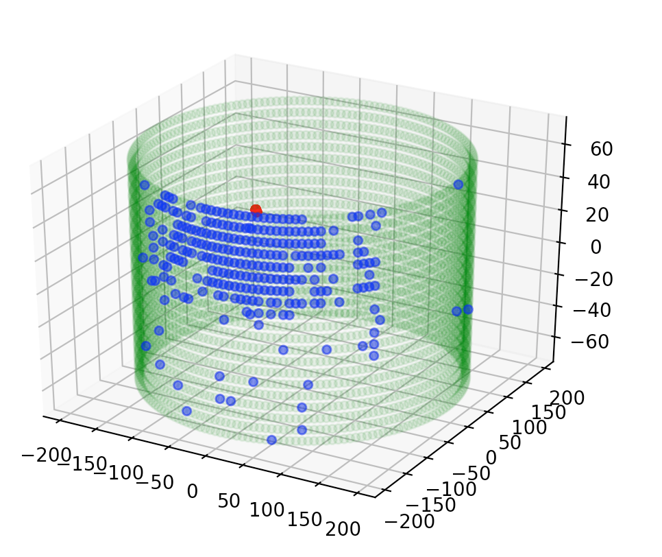

Build: [](https://circleci.com/gh/miguelsimon/petutils)

This is an attempt to nail down the things @mmkekic and @paolafer and me have been talking about, writing it down should also serve to bring to light any conceptual misunderstandings I might have about the whole endeavour before I go too far down a silly path haha.

* [Conceptual overview](#conceptual-overview)
* [Finding scintillation events](#finding-scintillation-events)
  * [Objectively measuring the quality of an algorithm](#objectively-measuring-the-quality-of-an-algorithm)
    * [Characterizing inputs and outputs](characterizing-inputs-and-outputs)
    * [Generating random events to evaluate the models](generating-random-events-to-evaluate-the-models)
    * [Pipeline](#pipeline)
    * [Notebook examples](#notebook-examples)
* [Usage](#usage)
  * [Data](#data)
  * [Visualizing MC simulations](#visualizing-mc-simulations)
  * [Dockerized nexus](#dockerized-nexus)

# Conceptual overview

As I understand it ([this poster](https://indico.cern.ch/event/716539/contributions/3245979/attachments/1799570/2934772/VCI2019_Romo.pdf) was helpful), the idea is to:
1. read the sensors to get photon counts at time steps
2. infer the scintillation events which caused these counts
3. infer beta decay events by finding scintillation event coincidences
4. infer beta decay density by estimating it from the beta decay events:



We'd like a **quantitative, objective** way to compare the effects of different petalo geometries, sensor counts, etc on the quality of the density estimation. Thanks to the nexus simulator we can build an automated system to give us objective reconstruction quality estimates given hyperparameters, as long as:
* the loss function we choose adequately captures what we mean by *quality*
* we have a more or less realistic prior for the beta decay densities
* we have enough computing power

At the end of this process we'll have a nice table that gives us reconstruction fidelity vs. cost for each configuration, something that looks like this:

| geometry | sensors | sipm type | loss | cost |
| -------- | ------- | --------- | ---- | ---- |
| std.1    | 20000 | v. 35     | 0.87 | 1 meeellion $ |
| std.1    | 40000 | v. 35     | 0.61 | 1.8 meeellion $ |
| std.2    | 40000 | v. 22     | 0.69 | 1.5 meeellion $ |

We'll start on the problem of inferring scintillation events given the detector counts.

# Finding scintillation events

We need to transform an input sensor signal spanning a certain time interval (which is a timeseries of photon counts) into a set of 511 kev scintillation events that ocurred in that time interval.

The paper ["Investigation of the Coincidence Resolving Time
performance of a PET scanner based on liquid
xenon: A Monte Carlo study"](https://arxiv.org/pdf/1604.04106.pdf) examines the theoretical resolution limits for PETALO when considering 1 such event; we're dealing with the noisy case.

In the noisy case, the sensor count signal can have:
* several events that are close enough in time
* noise from non-511 KeV scintillation events (?)
* noise from other sources eg. dark count rate
* others?

## Objectively measuring the quality of an algorithm

We want an objective way to compare different approaches to this reconstruction.

### Characterizing inputs and outputs

To do this, we'll need to choose a common interface that our different reconstruction algorithms must obey. Finding an appropriate interface is itself part of the problem. We need:

1. A characterization of the true event state space **X_t**
2. A characterization of the detector measurement state space **Y**
3. A characterization of the inferred event state space **X**
4. Loss function to quantify the difference between true events and inferred events **L(x_t, x)**

### Generating random events to evaluate the models

If we have characterized the inputs and outputs we can work on generating data for the algorithms.

### Pipeline

Given the interface and the simulator, comparing different algorithms is simply a matter of plugging them into the pipeline:



We can enforce and formalize the concepts discussed above by making (advanced) use of python's type system, see [petutils/experiment.py](petutils/experiment.py).

Implementing the interfaces defined here fully characterizes an executable experiment; this means that once X, XT, and Y types are defined:
* different teams can work on different parts of the problem and rely on the type system to guarantee integration goes smoothly
* different algorithms can be worked on independently and then compared objectively by plugging them into the pipeline

Careful use of protocols and generic types gives us the speed of python with the readability of C++ ;)

### Notebook examples

* [Trivial example to illustrate the approach](https://nbviewer.jupyter.org/github/miguelsimon/petutils/blob/master/trivial_experiment.ipynb)
* [Simplified example using petalo data](https://nbviewer.jupyter.org/github/miguelsimon/petutils/blob/master/simplified.ipynb)

# Usage

**Requires python >= 3.7**

* `make env_ok` sets up the python virtualenv with all dependencies
* `make check` runs [mypy](http://mypy-lang.org/) typechecking, flake8 checks, black and isort formatting checks
* `make test` runs unit tests
* `make fmt` reformats the code using black and isort
* `make run_notebook` runs a notebook server
* `make docs` builds the graphviz svgs

Bad formatting raises an error (as do type errors reported by mypy and flake F violations) so a good way to work is to run this all the time while developing:

```
make fmt && make test
```

## Data

The data file isn't in the repo so has to be fetched separately; I use `full_ring_iradius165mm_depth3cm_pitch7mm_new_h5.001.pet.h5` saved at the root of the repo for most examples.

## Visualizing MC simulations

To plot a random simulation event from an hdf5 file you can use this command (after running `make env_ok` of course):

```
env/bin/python -m petutils.plotter plot_rnd --hdf5_file ./full_ring_iradius165mm_depth3cm_pitch7mm_new_h5.001.pet.h5
```

You should get a rudimentary but useful matplotlib-based visualization like this:



## Dockerized nexus

The build process for nexus is well documented [here](https://next.ific.uv.es:8888/nextsw/nexus/wikis/home), I dockerized it.

This makes it easy to plug nexus into a continuous integration system if we have unit tests to validate its behaviour.

* Get dependencies:
  You'll need read access to the repos.
  `make download_deps`
* Build the nexus docker image:
  `make build-nexus-image`

Now you can run nexus in there, eg. run [the first example in the user's guide](https://next.ific.uv.es:8888/nextsw/nexus/wikis/User-guide#getting-started-running-a-simple-example) by launching the docker container:

`docker run -it --rm nexus`

and then:

`./nexus -b -n 100 macros/nexus_example1.init.mac`

You can connect to a built-in x session exposed via vnc so we can use the geant4 gui:
* port: 5900
* password: 1234

Use a vnc client to connect to it, on OS X for example this should work from the terminal
```
open vnc://localhost:5900
```
